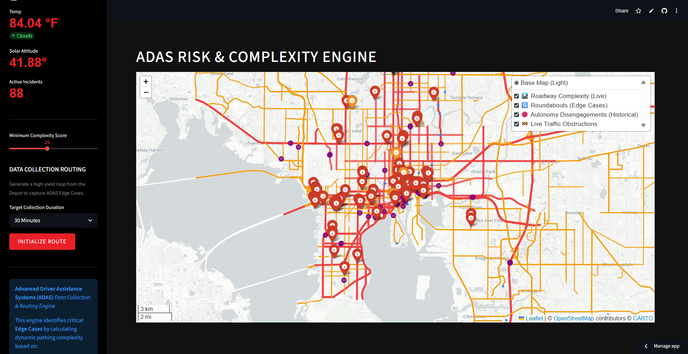
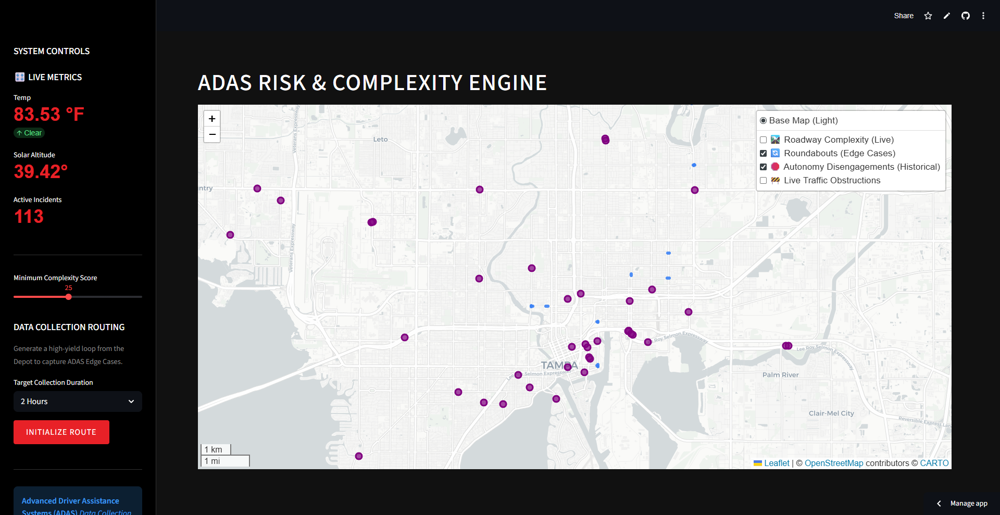
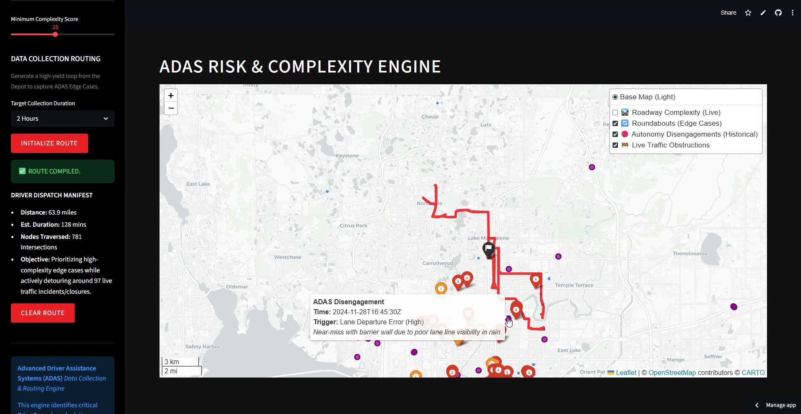

# Vanguard ADAS Data Collection Router

A Streamlit-based routing and mapping application for Advanced Driver Assistance Systems (ADAS) data collection. This tool generates vehicle routing loops by evaluating roadway complexity using geospatial data and live APIs, aiming to identify diverse spatial edge cases for autonomous vehicle testing.

## Currently Implemented Features

*   **Geospatial Complexity Scoring:** Applies configurable mathematical weights to road segments based on their presence in High-Injury Networks and FDOT flood zones.
*   **Weather & Solar Data Integration:** Uses the OpenWeatherMap API to compute current solar azimuth and altitude, which estimates potential camera glare and sensor occlusion.
*   **Traffic Incident Mapping:** Queries the TomTom API for active commercial traffic incidents to map real-time closures.
*   **Weighted Routing Algorithm:** Uses `osmnx` and `networkx` to generate loop routes originating from a central depot. The Dijkstra-based algorithm replaces standard distance-based routing by factoring in road complexity scores and scaled live-traffic avoidance penalties to suggest paths covering diverse geometric environments.

### Complexity Scoring Heuristics

The engine relies on a weighted risk matrix to calculate the "cost" of traversing an intersection. Higher scores represent higher priority for data collection.

| Factor | Weight | Description |
| :--- | :--- | :--- |
| **Base Complexity** | `+ 20` | Minimum global score applied to all mapped geometries. |
| **High Injury Network** | `+ 10 to 20` | Applied if the corridor is flagged for historical multi-modal crashes. |
| **Direct Solar Glare** | `+ up to 20` | Dynamic score generated when a road's bearing aligns directly with a low-altitude sun. |
| **Active Flood Zone** | `+ 25` | Stacked when FEMA Zone AE boundaries intersect with active rainfall API data. |
| **Traffic Incidents** | `10x to 1000x` | Dijkstra routing cost multiplier (penalty) applied to avoid routing into live closures. |

## Product Roadmap (Future Work)

*   **Spatial Clustering Analytics:** Implement DBSCAN to identify statistically significant geographic clusters of historical ADAS failures.
*   **Dynamic Radius Adjustment:** Scale the grid download radius algorithmically based on real-time traffic density rather than static time thresholds.
*   **GPX / GeoJSON Download:** Add export functionality for the generated Driver Manifest to be loaded directly into fleet management software.
*   **Asynchronous API Fetches:** Utilize `asyncio` to pull weather and traffic layers simultaneously to drop initial map-render latencies.

## Local Setup & Reproducibility

1.  Clone this repository.
2.  Install the required dependencies inside your virtual environment. The app was built using **Python 3.11**.
    *   *Note: For strict reproducibility, we recommend using `uv` or `Poetry` to lock versions.*
    *   `pip install -r requirements.txt`
3.  Set up your `.env` file with the necessary API keys (`OPENWEATHER_API_KEY` and `TOMTOM_API_KEY`). An example `.env.example` is provided in the repository root.
    *   *Note: If no API keys are provided, the map will still render local datasets but live layers will be hidden gracefully.*
4.  Run the Streamlit application: `streamlit run app.py`

## Streamlit Cloud Deployment

This repository is structured for immediate deployment on Streamlit Community Cloud:

1.  Push this code to your GitHub account.
2.  Log in to [Streamlit Community Cloud](https://streamlit.io/cloud).
3.  Click **New app** and authorize your GitHub account.
4.  Select your repository and branch.
5.  Set the Main file path to `app.py`.
6.  **Crucial TOML Formatting:** Click **Advanced settings** -> **Secrets**. Do NOT just paste the `.env` text. You MUST wrap your keys in double-quotes (`"`) to satisfy the Streamlit TOML parser, or the app will immediately crash.
    ```toml
    OPENWEATHER_API_KEY="your_api_key_here"
    TOMTOM_API_KEY="your_api_key_here"
    ```
7.  Click **Deploy!**

*(Note: Streamlit Community Cloud puts apps to "sleep" after 7 days of inactivity. Simply visit the URL to wake the app back up; it may take ~60 seconds to boot the first time.)*

## Tech Stack & Architecture
*   **Frontend UI:** Streamlit
*   **Web Mapping:** Folium (`map_utils.py`)
*   **Data Processing Pipeline:** GeoPandas, Pandas, Numpy
*   **Graph Routing & Cost Matrix:** OSMnx, NetworkX (`routing.py`)
*   **Complexity Heuristics:** Custom Python Math (`scoring.py`)
*   **Live Data Fetching:** OpenWeatherMap API, TomTom Traffic API (`api_handlers.py`)

## Screenshots





